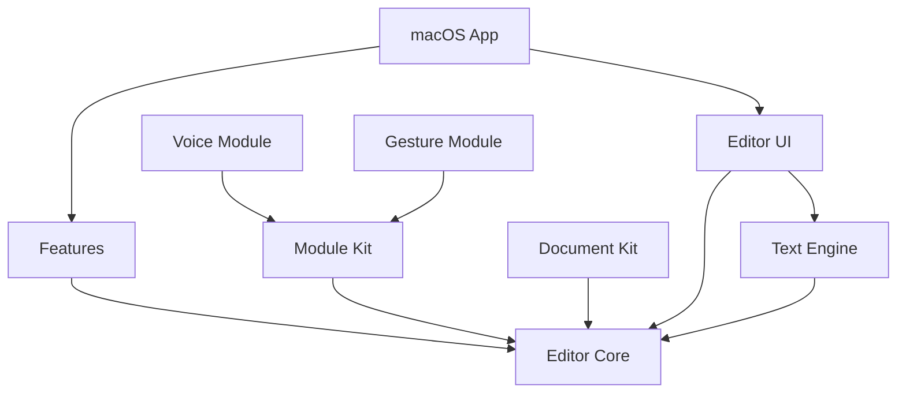

# Editor multimodal para escritura y TDAH — Especificación de implementación

## 1. Objetivo

Construir una aplicación de escritura nativa para macOS orientada a apoyar tareas de escritura en personas con TDAH.

La aplicación debe priorizar:

- concentración;
- baja carga cognitiva;
- interfaz limpia;
- respuesta inmediata;
- estabilidad;
- accesibilidad;
- privacidad;
- funcionamiento local;
- arquitectura modular;
- mantenibilidad;
- integración futura de interacción multimodal.

El editor debe funcionar perfectamente utilizando únicamente teclado y mouse/trackpad.

La voz y los gestos **NO forman parte del núcleo del editor**.

Se implementarán posteriormente como módulos independientes que puedan conectarse a la aplicación sin modificar el motor de texto.

La aplicación no debe diseñarse como "un editor de IA".

La IA, voz, reconocimiento de comandos o reconocimiento gestual son mecanismos secundarios que pueden asistir al usuario, nunca el centro de la experiencia.

---

# 2. Plataforma

## Tecnología

Implementar exclusivamente con tecnologías nativas de Apple.

- Swift 6.
- SwiftUI.
- AppKit cuando sea necesario.
- TextKit.
- Swift Concurrency.
- Observation.
- Swift Package Manager.
- XCTest / Swift Testing.
- OSLog.
- Foundation.

Evitar frameworks web.

No utilizar:

- React.
- Electron.
- Tauri.
- WebView como editor.
- JavaScript.
- servidor local.
- Node.js.

La aplicación debe ser una aplicación macOS real.

---

# 3. Compatibilidad

Objetivo inicial:

```text
macOS 15+
Apple Silicon prioritario
Intel compatible mientras las APIs utilizadas lo permitan
Swift 6
Strict Concurrency habilitado
```

No utilizar APIs exclusivas de una versión posterior de macOS cuando exista una alternativa estable razonable.

Las funcionalidades nuevas de macOS podrán utilizarse mediante:

```swift
if #available(macOS XX, *) {
    // API moderna
} else {
    // implementación compatible
}
```

---

# 4. Filosofía de arquitectura

El proyecto debe seguir esta dependencia conceptual:



Regla fundamental:

> Los módulos externos producen intenciones o comandos. Nunca manipulan directamente la interfaz ni el motor de texto.

Por ejemplo:

```text
VoiceModule
    ↓
EditorCommand.insertText("hola")
    ↓
EditorCommandBus
    ↓
EditorSession
    ↓
TextEditorEngine
    ↓
NSTextView
```

Y para gestos:

```text
GestureModule
    ↓
EditorCommand.toggleBold
    ↓
EditorCommandBus
    ↓
EditorSession
```

Esto permite cambiar completamente el sistema de voz o gestos sin tocar el editor.

---

# 5. Organización del proyecto

No crear decenas de paquetes innecesarios.

Utilizar:

```text
EditorTDAH/
│
├── App/
│   ├── EditorApp.swift
│   ├── AppCommands.swift
│   ├── AppEnvironment.swift
│   └── Resources/
│
├── Packages/
│   │
│   ├── EditorModules/
│   │   ├── Package.swift
│   │   │
│   │   ├── Sources/
│   │   │   ├── EditorCore/
│   │   │   ├── EditorEngine/
│   │   │   ├── EditorUI/
│   │   │   ├── DocumentKit/
│   │   │   ├── ModuleKit/
│   │   │   ├── SettingsFeature/
│   │   │   ├── FocusFeature/
│   │   │   ├── ExportFeature/
│   │   │   └── DesignSystem/
│   │   │
│   │   └── Tests/
│   │
│   ├── VoiceModule/
│   │   └── FUTURE
│   │
│   └── GestureModule/
│       └── FUTURE
│
├── EditorTDAHTests/
├── EditorTDAHUITests/
│
└── README.md
```

`EditorModules` será un Swift Package local con varios targets.

La aplicación principal debe ser extremadamente pequeña.

---

# 6. Dependencias entre módulos

Aplicar estrictamente:

```text
EditorCore
↑
├── EditorEngine
├── DocumentKit
├── ModuleKit
├── FocusFeature
├── SettingsFeature
└── ExportFeature

EditorUI
├── EditorCore
├── EditorEngine
└── DesignSystem
```

Nunca:

```text
EditorCore → EditorUI
EditorCore → VoiceModule
EditorEngine → VoiceModule
EditorEngine → GestureModule
VoiceModule → NSTextView
GestureModule → NSTextView
```

No introducir dependencias circulares.

---

# 7. EditorCore

`EditorCore` contiene únicamente modelos y conceptos independientes de UI.

No debe importar SwiftUI ni AppKit.

Ejemplos:

```text
EditorDocument
EditorSelection
TextRange
EditorCommand
EditorCapability
EditorState
EditorPreferences
WritingSession
```

Ejemplo:

```swift
public struct TextRange: Equatable, Sendable {
    public var location: Int
    public var length: Int

    public init(location: Int, length: Int) {
        self.location = location
        self.length = length
    }
}
```

---

# 8. Sistema de comandos

Toda interacción que pueda modificar el editor debe poder representarse mediante un comando.

```swift
public enum EditorCommand: Sendable, Equatable {
    case insertText(String)
    case replaceSelection(String)
    case deleteBackward
    case deleteForward

    case moveCursorForward
    case moveCursorBackward
    case moveCursorToBeginning
    case moveCursorToEnd

    case selectAll
    case selectRange(TextRange)

    case undo
    case redo

    case toggleBold
    case toggleItalic

    case increaseTextSize
    case decreaseTextSize

    case toggleFocusMode
    case toggleTypewriterMode

    case save
}
```

Los comandos deben representar **intención**, no detalles de AppKit.

Incorrecto:

```swift
case modifyNSTextView(NSTextView)
```

Correcto:

```swift
case replaceSelection("nuevo texto")
```

---

# 9. EditorCommandBus

Crear un intermediario entre módulos y editor.

```swift
public actor EditorCommandBus {

    private var continuation:
        AsyncStream<EditorCommand>.Continuation?

    public init() {}

    public func commands() -> AsyncStream<EditorCommand> {
        AsyncStream { continuation in
            self.continuation = continuation
        }
    }

    public func send(_ command: EditorCommand) {
        continuation?.yield(command)
    }
}
```

En producción debe manejar correctamente:

- ciclo de vida;
- múltiples productores;
- cancelación;
- cierre del stream;
- errores cuando corresponda.

No utilizar `NotificationCenter` como arquitectura principal entre módulos.

No crear un EventBus global sin tipos.

---

# 10. Contrato para módulos multimodales

Crear en `ModuleKit`:

```swift
public protocol EditorInputModule: Sendable {

    var identifier: String { get }

    var displayName: String { get }

    func start(
        context: EditorModuleContext
    ) async throws

    func stop() async
}
```

Contexto:

```swift
public struct EditorModuleContext: Sendable {

    public let commandBus: EditorCommandBus

    public init(commandBus: EditorCommandBus) {
        self.commandBus = commandBus
    }
}
```

Así un módulo puede hacer:

```swift
await context.commandBus.send(
    .insertText("Esta es una prueba.")
)
```

pero no puede acceder a:

```text
NSTextView
NSWindow
EditorView
EditorDocument internals
NSApplication
```

---

# 11. VoiceModule

NO implementar todavía el reconocimiento de voz final.

La arquitectura debe permitir incorporar posteriormente:

```text
VoiceModule/
├── VoiceModule.swift
├── AudioCapture/
├── SpeechRecognition/
├── CommandParser/
├── Dictation/
└── Tests/
```

El flujo futuro será:

```text
Micrófono
↓
Audio
↓
Speech-to-Text
↓
Intent Parser
↓
EditorCommand
↓
EditorCommandBus
```

Ejemplos:

```text
"escribe hola mundo"

→ insertText("hola mundo")
```

```text
"borra lo último que escribí"

→ undo
```

```text
"selecciona esta oración"

→ selectRange(...)
```

```text
"pon esto en negritas"

→ toggleBold
```

El módulo de voz decide qué comando producir.

El editor no sabe si el comando vino de:

- teclado;
- voz;
- gesto;
- menú;
- toolbar;
- atajo.

---

# 12. GestureModule

El módulo de gestos seguirá exactamente el mismo principio.

```text
Cámara
↓
Detector
↓
Clasificador de gesto
↓
GestureIntent
↓
EditorCommand
```

Ejemplo:

```text
mano abierta
    ↓
GestureIntent.stop
    ↓
EditorCommand...
```

No implementar lógica de cámara dentro del target principal.

El target principal tampoco deberá solicitar permiso de cámara si el módulo no se encuentra activo.

---

# 13. Motor de texto

No utilizar `TextEditor` de SwiftUI como motor principal.

Crear un editor nativo basado en:

```text
NSTextView
+
TextKit
+
NSTextLayoutManager
```

SwiftUI debe actuar como contenedor.

Arquitectura:

```text
SwiftUI

EditorView
    ↓
NativeTextEditor

NSViewRepresentable
    ↓
NSTextView
    ↓
TextKit
```

Crear:

```text
EditorEngine/
├── TextEditorEngine.swift
├── TextEditorCoordinator.swift
├── NativeTextView.swift
├── TextSelectionController.swift
├── TextFormattingController.swift
└── TextMetrics.swift
```

---

# 14. NativeTextEditor

Debe encapsular completamente AppKit.

Una aproximación:

```swift
struct NativeTextEditor: NSViewRepresentable {

    @Bindable var session: EditorSession

    func makeNSView(
        context: Context
    ) -> NSScrollView {
        // Crear NSTextView
    }

    func updateNSView(
        _ scrollView: NSScrollView,
        context: Context
    ) {
        // Sincronización mínima
    }
}
```

No reemplazar todo el contenido de `NSTextView` en cada actualización de SwiftUI.

Esto es crítico.

Evitar:

```swift
textView.string = session.text
```

en cada render.

SwiftUI no debe mantener una copia completa del documento sincronizada carácter por carácter si eso provoca copias innecesarias.

El motor TextKit debe ser responsable de la edición activa.

---

# 15. EditorSession

`EditorSession` representa una sesión de edición abierta.

Debe ejecutarse en MainActor:

```swift
@MainActor
@Observable
public final class EditorSession {

    public private(set) var selection: TextRange
    public private(set) var statistics: EditorStatistics

    public var focusModeEnabled: Bool
    public var typewriterModeEnabled: Bool

    // ...
}
```

No almacenar todo lo que exista en `NSTextView` como propiedades observables.

Solo publicar a SwiftUI información que realmente afecte a la UI.

Ejemplos:

```text
selección
cantidad de palabras
estado de enfoque
archivo modificado
zoom
modo activo
```

---

# 16. Modelo del documento

Formato principal inicial:

```text
Markdown UTF-8
```

Extensión:

```text
.md
```

También aceptar:

```text
.txt
```

La decisión de utilizar Markdown permite:

- documentos portables;
- texto legible sin la aplicación;
- almacenamiento simple;
- control de versiones;
- recuperación sencilla;
- exportación posterior;
- baja complejidad.

El editor visual puede presentar formato sin convertir la interfaz en un editor de código Markdown.

---

# 17. DocumentKit

Responsable exclusivamente de:

```text
abrir
leer
guardar
autosave
recuperar
importar
exportar
```

No debe implementar UI.

Crear abstracción:

```swift
public protocol DocumentStore: Sendable {

    func load(
        from url: URL
    ) async throws -> EditorDocumentSnapshot

    func save(
        _ document: EditorDocumentSnapshot,
        to url: URL
    ) async throws
}
```

El almacenamiento nunca debe bloquear el MainActor.

---

# 18. Autosave

Implementar guardado seguro.

Requisitos:

```text
No guardar después de cada carácter.
No bloquear el hilo principal.
No perder texto si la app se cierra normalmente.
No sobrescribir archivos corruptos a ciegas.
```

Utilizar estrategia de debounce.

Ejemplo conceptual:

```text
usuario escribe
↓
document dirty
↓
esperar ~1–2 segundos sin escritura
↓
crear snapshot
↓
guardar fuera del MainActor
```

Cancelar tareas antiguas cuando exista una nueva modificación.

El guardado manual con:

```text
⌘S
```

debe tener prioridad inmediata.

---

# 19. Undo / Redo

Utilizar `UndoManager` y las capacidades nativas de `NSTextView`.

Atajos:

```text
⌘Z
⇧⌘Z
```

Voz y gestos deben poder ejecutar exactamente el mismo mecanismo.

No construir un segundo sistema de undo independiente salvo que exista una razón técnica demostrable.

---

# 20. UI principal

La interfaz debe parecer una aplicación macOS nativa.

No diseñar una página web dentro de una ventana.

Utilizar:

```text
NavigationSplitView cuando sea necesario
Toolbar nativa
Settings scene
Commands
MenuBar commands
SF Symbols
NSWindow behavior nativo
```

Diseño general:

```text
┌──────────────────────────────────────────────┐
│       título                controles        │
├──────────────────────────────────────────────┤
│                                              │
│             área de escritura                │
│                                              │
│             texto centrado                   │
│                                              │
│                                              │
│                                              │
└──────────────────────────────────────────────┘
```

La escritura debe dominar visualmente la aplicación.

---

# 21. Lenguaje visual

Seguir el lenguaje de diseño de macOS.

Evitar:

- gradientes innecesarios;
- sombras decorativas;
- tarjetas para todo;
- bordes gruesos;
- botones gigantes;
- colores saturados;
- paneles constantemente visibles;
- iconos sin función;
- animaciones decorativas.

Utilizar materiales del sistema únicamente cuando tengan sentido.

La aplicación debe sentirse tranquila.

---

# 22. Área de escritura

Ancho de lectura configurable.

Valor inicial aproximado:

```text
720–780 pt
```

El texto no debe ocupar automáticamente todo el ancho de una pantalla ultrawide.

Permitir:

```text
estrecho
medio
ancho
```

Nunca cambiar la anchura del documento mientras el usuario escribe.

---

# 23. Tipografía

Por defecto utilizar una tipografía del sistema diseñada para lectura.

Permitir modificar:

```text
familia
tamaño
interlineado
anchura de columna
```

Tamaño inicial:

```text
17–18 pt
```

Evitar interfaces con texto diminuto.

---

# 24. Herramientas específicas para concentración

Estas herramientas deben ser opcionales.

Nunca imponerlas.

## Focus Mode

Al activarlo:

- ocultar elementos secundarios;
- reducir toolbar;
- eliminar información innecesaria;
- conservar únicamente documento y controles esenciales.

Atajo configurable.

---

## Line Focus

Resaltar discretamente:

```text
línea actual
```

o:

```text
párrafo actual
```

El resto del documento puede disminuir ligeramente de contraste.

No oscurecerlo excesivamente.

---

## Typewriter Mode

Mantener la línea activa cerca de una zona estable de la ventana mientras se escribe.

Debe poder desactivarse.

No realizar scroll brusco.

---

## Reduced Interface

Modo que deja visibles únicamente:

```text
documento
título
acciones esenciales
```

---

# 25. Información secundaria

Elementos como:

```text
conteo de palabras
conteo de caracteres
tiempo
objetivos
estado del documento
```

no deben permanecer llamando la atención constantemente.

Mostrar preferentemente:

- en status bar discreta;
- mediante inspector;
- bajo demanda.

Permitir ocultarlos completamente.

---

# 26. Toolbar

Toolbar inicial mínima.

Ejemplo:

```text
Sidebar | Texto | Focus | Opciones
```

No añadir 20 botones.

Las herramientas de formato poco frecuentes pueden vivir dentro de menús.

---

# 27. Menús macOS

Implementar correctamente:

```text
File
Edit
Format
View
Window
Help
```

Atajos estándar:

```text
⌘N
⌘O
⌘S
⇧⌘S
⌘W

⌘Z
⇧⌘Z
⌘X
⌘C
⌘V
⌘A
⌘F

⌘B
⌘I
```

No reinventar convenciones conocidas de macOS.

---

# 28. Configuración

Utilizar:

```swift
Settings {
    SettingsView()
}
```

Secciones:

```text
General
Editor
Concentración
Apariencia
Multimodalidad
Privacidad
```

---

# 29. General

Opciones:

```text
Abrir último documento
Crear documento vacío al iniciar
Autosave
Restaurar ventanas
```

---

# 30. Editor

Configurable:

```text
Tipografía
Tamaño
Interlineado
Ancho del documento
Corrección ortográfica
Comillas inteligentes
Guiones inteligentes
Mostrar conteo de palabras
```

---

# 31. Concentración

Configurable:

```text
Focus Mode
Line Focus
Paragraph Focus
Typewriter Mode
Reducir elementos visuales
Ocultar estadísticas
Reducir animaciones
```

No activar automáticamente todas las herramientas por tener TDAH.

El usuario decide cuáles le sirven.

---

# 32. Multimodalidad

La pantalla debe estar preparada para mostrar posteriormente:

```text
Voz
    [Desactivado]

Gestos
    [Desactivado]
```

Si el módulo no está instalado/compilado:

```text
Voz
Módulo no disponible
```

No mostrar controles falsos que aparenten funcionar.

---

# 33. Privacidad

Por defecto:

```text
procesamiento local
sin telemetría
sin cuenta
sin nube
sin analíticas externas
```

La aplicación debe poder utilizarse completamente offline.

No enviar el contenido escrito a servidores externos.

---

# 34. Permisos

Principio:

> solicitar únicamente el permiso necesario cuando el usuario active la funcionalidad que lo requiere.

El editor base necesita:

```text
acceso a archivos seleccionados por el usuario
```

El módulo futuro de voz solicitará:

```text
micrófono
```

El módulo futuro de gestos:

```text
cámara
```

El editor principal no debe pedir cámara ni micrófono al arrancar.

---

# 35. App Sandbox

Mantener App Sandbox activo.

Permitir únicamente acceso de lectura/escritura a archivos elegidos explícitamente por el usuario.

No solicitar Full Disk Access.

No acceder arbitrariamente al Home del usuario.

No almacenar documentos fuera de ubicaciones autorizadas.

---

# 36. Seguridad

Reglas obligatorias:

```text
No force unwraps en lógica de producción.
No credenciales hardcodeadas.
No ejecución arbitraria de shell.
No deserialización insegura.
No almacenamiento de secretos en UserDefaults.
No permisos que no sean necesarios.
No requests de red desde EditorCore.
```

Si posteriormente existen tokens o credenciales:

```text
Keychain
```

---

# 37. Concurrencia

Compilar con Swift 6 strict concurrency.

Usar:

```text
async/await
actors
Sendable
MainActor
AsyncSequence
```

UI:

```text
@MainActor
```

I/O:

```text
fuera del MainActor
```

Procesamiento pesado:

```text
fuera del MainActor
```

Evitar:

```swift
DispatchQueue.main.async {
    ...
}
```

cuando pueda expresarse correctamente mediante Swift Concurrency.

Evitar `Task.detached` salvo que esté claramente justificado.

---

# 38. Reglas de rendimiento

La experiencia de escritura tiene máxima prioridad.

Nunca realizar durante una pulsación:

```text
lectura de disco
escritura de disco
parsing completo del documento
análisis de IA
reconocimiento de voz
procesamiento de cámara
conteo completo costoso
```

Una pulsación debe modificar el texto y regresar inmediatamente.

Procesos secundarios deben ser:

```text
debounced
incrementales
asíncronos
cancelables
```

---

# 39. Estadísticas

No recalcular todo el documento en cada tecla si puede evitarse.

Para:

```text
palabras
caracteres
párrafos
```

usar debounce.

Ejemplo:

```text
escritura
↓
300 ms sin cambios
↓
actualizar estadísticas
```

La actualización no debe bloquear el editor.

---

# 40. Archivos grandes

Probar como mínimo documentos de:

```text
100 000 caracteres
500 000 caracteres
1 000 000 caracteres
```

Debe seguir siendo posible:

```text
escribir
seleccionar
buscar
hacer scroll
deshacer
guardar
```

sin congelamientos visibles.

No copiar strings gigantes innecesariamente.

---

# 41. SwiftUI

Evitar vistas gigantes.

Incorrecto:

```text
ContentView.swift
2000 líneas
```

Separar por responsabilidad.

Ejemplo:

```text
EditorScreen
EditorToolbar
EditorCanvas
EditorStatusBar
FocusControls
DocumentTitleView
SettingsView
```

---

# 42. Estado

No crear un `AppState` gigantesco.

Utilizar estados por dominio.

Por ejemplo:

```text
EditorSession
EditorPreferences
FocusState
ModuleRegistry
```

Inyectar dependencias explícitamente.

Evitar singletons globales.

---

# 43. DesignSystem

Crear un target pequeño.

Debe contener:

```text
Spacing
Typography
EditorMetrics
Reusable controls
```

No crear un sistema de diseño empresarial innecesariamente complejo.

Ejemplo:

```swift
public enum EditorSpacing {
    public static let small: CGFloat = 8
    public static let medium: CGFloat = 12
    public static let large: CGFloat = 20
}
```

---

# 44. Accesibilidad

Todos los controles deben tener:

```text
accessibilityLabel
accessibilityHint cuando sea necesario
keyboard navigation
focus correcto
```

Comprobar:

```text
VoiceOver
Reduce Motion
Increase Contrast
Reduce Transparency
```

No depender únicamente del color para indicar estado.

---

# 45. Animaciones

Utilizar animaciones únicamente para:

```text
transiciones funcionales
cambio de panel
feedback ligero
```

Duraciones cortas.

Respetar:

```text
Reduce Motion
```

No animar:

```text
cada tecla
estadísticas
cursor personalizado
fondos
decoraciones
```

---

# 46. Logging

No utilizar:

```swift
print()
```

en código final.

Utilizar:

```swift
import OSLog

let logger = Logger(
    subsystem: "com.editor.app",
    category: "documents"
)
```

Nunca registrar:

```text
contenido del documento
dictado completo
audio
texto privado
```

---

# 47. Errores

Crear errores tipados.

Ejemplo:

```swift
public enum DocumentError: LocalizedError {
    case invalidEncoding
    case unableToRead
    case unableToWrite
}
```

La UI debe mostrar mensajes comprensibles.

No mostrar:

```text
NSCocoaErrorDomain Code=...
```

como mensaje principal al usuario.

---

# 48. Búsqueda

Implementar:

```text
⌘F
```

utilizando capacidades nativas siempre que sea posible.

La búsqueda debe manejar documentos grandes sin recrear toda la vista.

---

# 49. Exportación

Separar en:

```text
ExportFeature
```

Arquitectura:

```swift
public protocol DocumentExporter: Sendable {
    func export(
        document: EditorDocumentSnapshot,
        destination: URL
    ) async throws
}
```

Posibles exportadores futuros:

```text
PlainTextExporter
MarkdownExporter
RTFExporter
PDFExporter
HTMLExporter
```

No mezclar exportación con el motor de edición.

---

# 50. Módulos opcionales futuros

La arquitectura deberá permitir posteriormente:

```text
VoiceModule
GestureModule
WritingAssistanceModule
ResearchMetricsModule
```

sin modificar `EditorEngine`.

---

# 51. ResearchMetricsModule

Si posteriormente se recolectan métricas para la tesis, hacerlo mediante un módulo independiente.

Por ejemplo:

```text
duración de sesión
cantidad de interrupciones
cambios de modalidad
comandos de voz utilizados
gestos utilizados
```

Nunca registrar automáticamente el contenido escrito.

Debe existir consentimiento explícito antes de registrar métricas de investigación.

---

# 52. ModuleRegistry

Crear:

```swift
@MainActor
@Observable
public final class ModuleRegistry {

    public private(set) var modules:
        [ModuleDescriptor] = []

    public func register(
        _ module: ModuleDescriptor
    ) {
        // ...
    }
}
```

Los módulos reales pueden registrarse durante el arranque.

Ejemplo futuro:

```swift
registry.register(
    VoiceModule.descriptor
)

registry.register(
    GestureModule.descriptor
)
```

No implementar carga dinámica arbitraria de bundles de terceros.

Los módulos serán Swift Packages compilados con la aplicación.

Esto mantiene:

```text
seguridad
type safety
sandbox
facilidad de testing
```

---

# 53. Dependency Injection

Construir las dependencias en un único composition root.

Por ejemplo:

```swift
@main
struct EditorApp: App {

    private let dependencies =
        AppDependencies.live()

    var body: some Scene {
        // ...
    }
}
```

`AppDependencies` puede contener:

```text
DocumentStore
EditorCommandBus
ModuleRegistry
PreferencesStore
```

Las pruebas deben poder utilizar implementaciones fake.

---

# 54. Testing

El proyecto no se considera terminado únicamente porque compile.

Crear pruebas para cada capa.

## EditorCore

Probar:

```text
rangos
selección
comandos
estadísticas
transformaciones
```

## DocumentKit

Probar:

```text
abrir UTF-8
guardar UTF-8
archivo vacío
archivo grande
caracteres Unicode
emoji
japonés
acentos
recuperación de errores
```

## ModuleKit

Probar:

```text
registro
start
stop
envío de comandos
cancelación
```

## EditorEngine

Probar:

```text
insertar
reemplazar selección
borrar
undo
redo
formato
selección
```

---

# 55. UI Tests

Automatizar como mínimo:

```text
crear documento
escribir
guardar
cerrar
volver a abrir
buscar
activar Focus Mode
cambiar preferencias
undo
redo
```

---

# 56. Performance Tests

Añadir pruebas y utilizar Instruments.

Comprobar:

```text
Time Profiler
Allocations
Leaks
Hangs
SwiftUI
```

Especialmente durante:

```text
escritura continua
scroll rápido
documentos grandes
guardar
abrir
Focus Mode
```

---

# 57. Memory Leaks

Verificar que al cerrar un documento se liberen:

```text
NSTextView
EditorSession
Text storage
Tasks
AsyncStreams
observers
```

Evitar retain cycles en:

```text
Coordinator
closures
Tasks
continuations
```

---

# 58. Calidad de código

Reglas obligatorias:

```text
Una responsabilidad por tipo.
Nombres claros.
Funciones pequeñas.
Dependencias explícitas.
Protocolos únicamente donde aportan una frontera real.
Nada de abstracciones prematuras.
Nada de arquitectura ceremonial.
```

No crear:

```text
Manager
Helper
Utils
Service
```

sin una responsabilidad claramente definida.

Preferir nombres como:

```text
DocumentStore
TextStatisticsCalculator
EditorCommandBus
ModuleRegistry
```

---

# 59. Comentarios

No comentar cosas obvias.

Malo:

```swift
// Incrementa contador
counter += 1
```

Bueno:

```swift
// NSTextView reports UTF-16 offsets, while our public
// model uses character offsets. Convert at this boundary.
```

Explicar principalmente:

```text
por qué
restricciones
decisiones no evidentes
workarounds de APIs
```

---

# 60. Dependencias externas

Por defecto:

```text
0 dependencias externas
```

Antes de añadir una librería comprobar:

```text
¿Foundation/AppKit/SwiftUI ya lo hacen?
¿El beneficio justifica mantenimiento adicional?
¿Tiene licencia adecuada?
¿Está activamente mantenida?
¿Aumenta la superficie de ataque?
```

No incorporar una dependencia por una función trivial.

---

# 61. Formateo

Mantener formato Swift consistente.

Evitar líneas innecesariamente largas.

Utilizar nombres Swift idiomáticos.

Ejemplo:

```swift
func saveDocument()
```

No:

```swift
func Save_Document_Function()
```

---

# 62. Git

Branches sugeridas:

```text
main
develop

feature/editor-engine
feature/document-system
feature/focus-mode
feature/settings
feature/voice-module
feature/gesture-module
```

Commits pequeños y coherentes.

Ejemplo:

```text
feat(editor): add TextKit editor engine
fix(document): avoid blocking save on main actor
test(core): cover selection transformations
```

---

# 63. Primera fase de implementación

Construir primero:

```text
EditorCore
EditorEngine
EditorUI
DocumentKit
DesignSystem
```

Resultado:

> editor nativo que abre, escribe, guarda y vuelve a abrir documentos correctamente.

No implementar todavía multimodalidad.

---

# 64. Segunda fase

Implementar:

```text
Focus Mode
Line Focus
Typewriter Mode
Settings
Statistics
Search
```

---

# 65. Tercera fase

Implementar:

```text
exportación
accesibilidad
optimización
tests de rendimiento
restauración de estado
```

---

# 66. Cuarta fase

Una vez estable el editor:

```text
VoiceModule
```

Desarrollarlo como paquete independiente.

El editor no debe necesitar modificaciones estructurales para recibirlo.

---

# 67. Quinta fase

Después:

```text
GestureModule
```

Misma regla.

La integración deberá reducirse esencialmente a:

```swift
registry.register(...)
```

más la configuración necesaria.

---

# 68. Criterios de aceptación del editor base

El editor base está listo únicamente cuando:

- abre rápidamente;
- permite crear documentos;
- permite abrir `.md`;
- permite abrir `.txt`;
- escribe sin lag visible;
- permite guardar;
- autosave funciona;
- undo funciona;
- redo funciona;
- selección funciona correctamente;
- copiar/pegar funciona;
- búsqueda funciona;
- atajos estándar funcionan;
- Focus Mode funciona;
- preferencias persisten;
- soporta Dark Mode;
- funciona con VoiceOver;
- no pide micrófono;
- no pide cámara;
- funciona sin internet;
- funciona con App Sandbox;
- no pierde contenido al cerrar normalmente;
- no existen crashes conocidos en el flujo principal.

---

# 69. Criterios arquitectónicos

Antes de considerar la arquitectura terminada comprobar que:

```text
VoiceModule puede eliminarse y el editor sigue compilando.

GestureModule puede eliminarse y el editor sigue compilando.

EditorCore no importa SwiftUI.

EditorCore no importa AppKit.

ModuleKit no conoce NSTextView.

VoiceModule no conoce NSTextView.

GestureModule no conoce NSTextView.

DocumentKit no conoce la UI.

EditorUI no realiza I/O directamente.
```

Si alguna de estas condiciones falla, revisar la arquitectura.

---

# 70. Comportamiento visual inicial

Al abrir un documento mostrar directamente el contenido.

No mostrar:

```text
dashboard
home gigante
frases motivacionales
widgets
estadísticas
IA
```

El usuario abrió el editor para escribir.

Por tanto:

```text
abrir aplicación
↓
abrir/crear documento
↓
escribir
```

Debe ser el camino principal.

---

# 71. Principio de interacción

La aplicación debe seguir:

> La interfaz aparece cuando se necesita y desaparece cuando deja de ser necesaria.

Ejemplo:

El usuario selecciona texto:

```text
→ aparecen opciones relacionadas.
```

El usuario vuelve a escribir:

```text
→ desaparecen elementos secundarios.
```

No mantener herramientas flotantes continuamente.

---

# 72. Objetivo de experiencia

La aplicación debe sentirse como:

```text
un editor macOS cuidadosamente diseñado
```

y no como:

```text
un prototipo académico
un dashboard
una aplicación web empaquetada
un chatbot
un editor de IA
```

El soporte para TDAH debe aparecer principalmente mediante:

```text
reducción de distracciones
personalización
estructura visual
foco
consistencia
respuesta rápida
control del usuario
multimodalidad opcional
```

No mediante una interfaz etiquetada constantemente como "para TDAH".

---

# 73. Regla para Codex

Al implementar una característica:

1. localizar primero el módulo responsable;
2. respetar las fronteras de dependencias;
3. escribir el modelo o protocolo necesario;
4. implementar la funcionalidad;
5. añadir pruebas;
6. compilar;
7. corregir warnings;
8. ejecutar tests;
9. revisar concurrencia;
10. comprobar que no se degradó la experiencia de escritura.

No solucionar problemas introduciendo dependencias entre módulos incorrectos.

---

# 74. Definition of Done

Una tarea solo está terminada cuando:

```text
compila sin errores
no introduce warnings nuevos
tests pasan
strict concurrency pasa
no bloquea MainActor
respeta App Sandbox
respeta arquitectura
funciona mediante teclado
funciona en Dark Mode
tiene accesibilidad básica
no introduce dependencias innecesarias
```

---

# 75. Prioridad absoluta

Cuando exista una decisión entre:

```text
más funcionalidades
```

y:

```text
mejor experiencia de escritura
```

elegir la experiencia de escritura.

Cuando exista una decisión entre:

```text
arquitectura sofisticada
```

y:

```text
arquitectura simple y mantenible
```

elegir la arquitectura simple.

Cuando exista una decisión entre:

```text
efecto visual
```

y:

```text
menor distracción
```

elegir menor distracción.

---

# 76. Resultado esperado

La primera versión final debe ser un editor macOS nativo, rápido y estable que pueda utilizarse diariamente incluso si jamás se instalan los módulos de voz y gestos.

Posteriormente:

```text
Editor
  +
VoiceModule
  +
GestureModule
```

deben convertirse en una experiencia multimodal sin alterar el núcleo.

La multimodalidad debe ser una extensión de un buen editor.

Nunca una dependencia para que el editor sea usable.